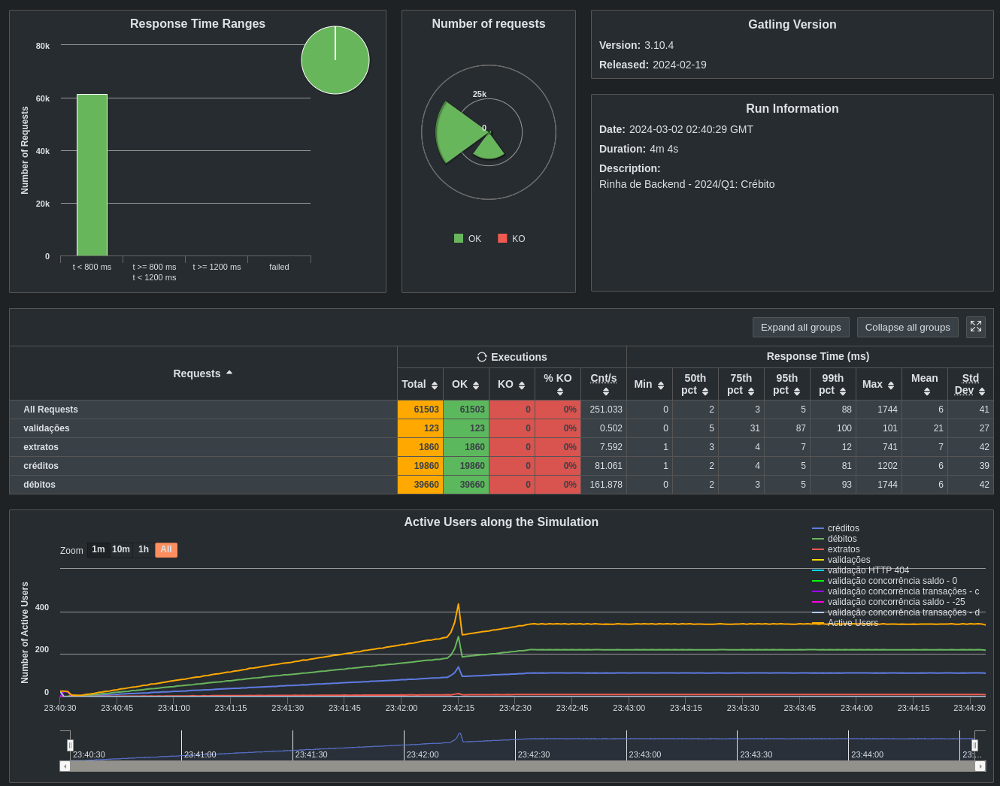

# API de crébito para Rinha de Backend, Segunda Edição: 2024/Q1 - Controle de Concorrência

[Repositório da rinha](https://github.com/zanfranceschi/rinha-de-backend-2024-q1/tree/main)

## Rodando projeto

### Rodando o projeto
``` bash
  make run
```

### Compilando
``` bash
  make build
```

### Exluindo arquivos do build
``` bash
  make clean 
```

### Compilando e executando binários
``` bash
  make exec
```

### Criando imagens docker
``` bash
  make docker-build-images
```

### Publicando imagens docker
``` bash
  make docker-push-images
```

### Criando e publicando imagens
``` bash
  make docker-build
```

### Rodando API e banco de dados em containers docker
``` bash
  make docer-run
```

### Iniciando containers já criados
``` bash
  make docker-start
```

### Parando containers criados
``` bash
  make docker-stop
```

### Deletando imagens sem tag, containers e redes criadas
``` bash
  make docker-clean
```


## Resultado do teste local

